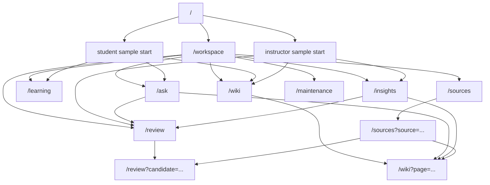

# Knowloop Frontend Site Definition

## Purpose

`SITE.md` defines the product structure, routing model, page relationships, and build order for the Knowloop frontend.
Use it with `DESIGN.md`.

If `DESIGN.md` defines how the product should feel, `SITE.md` defines what the frontend contains and how users move through it.

---

## 1. Product Definition

Knowloop is a role-aware knowledge operations console for Korean education teams.
It is not a single chat surface.
The frontend must make the full workflow visible:

`question -> accumulate -> review -> promote -> explore`

Primary value by role:

- Student: ask grounded questions, keep a durable learning record, revisit weak concepts
- Instructor: detect repeated confusion, review candidate knowledge, keep course wiki healthy
- Operator: manage operational sources, FAQs, and policy-facing knowledge
- Validator: approve, merge, drop, and repair candidate-to-wiki state transitions

---

## 2. Frontend MVP Principles

1. The product shell must feel like one system, not a set of unrelated pages.
2. Every major page should expose a real product object: `Source`, `Session`, `Candidate`, `Wiki Page`, or `Learning Note`.
3. Every page should show scope clearly: role, course, class, and domain.
4. The frontend must stay grounded in the existing backend API surface. Do not invent page flows that the backend cannot support.
5. Korean users are the default audience. Use Korean-first copy with selective English where natural.

---

## 3. Global Navigation Model

### Default Primary Navigation

- Workspace
- Ask
- Learning
- Wiki
- Review
- Insights
- Sources
- Maintenance

### Role-Aware Visibility

#### Student

- Workspace
- Ask
- Learning
- Wiki

#### Instructor

- Workspace
- Ask
- Wiki
- Review
- Insights
- Sources
- Maintenance

#### Operator

- Workspace
- Review
- Sources

#### Validator

- Workspace
- Review
- Wiki
- Maintenance

---

## 4. Route Map

### Core Pages

- `/`
- `/workspace`
- `/ask`
- `/learning`
- `/wiki`
- `/review`
- `/insights`
- `/sources`
- `/maintenance`

### Support and Shared Flows

- `/context` may redirect into `/workspace` if a dedicated route is kept
- detail selection currently uses query-param deep links instead of dynamic route segments
  - `/wiki?page=<page-id>`
  - `/review?candidate=<candidate-id>`
  - `/sources?source=<source-id>`
- modal, drawer, and panel states should not create unnecessary standalone routes unless they need shareable URLs

---

## 5. Sitemap

---

## 6. Page Inventory

### 6.1 `/`

Purpose:

- introduce Knowloop as a maintained knowledge operations product, not a generic AI chat app
- let judges and first-time users understand the workflow in under one minute
- provide immediate seeded demo entry through two high-trust sample-start buttons

Primary UX requirements:

- concise hero with strong product explanation
- workflow section showing `question -> accumulate -> review -> promote -> explore`
- two primary start buttons only
  - `학생용 샘플 데이터로 시작`
  - `교강사용 샘플 데이터로 시작`
- product trust section explaining evidence, candidate review, and maintained wiki

Primary backend dependency:

- none required for the informational sections
- sample-start buttons must link into the existing context bootstrap flow using canonical sample profiles

Current implementation note:

- until the dedicated home entry page is shipped, the live root route may temporarily redirect into `/workspace`
- this document defines the target contract for the next frontend slice

### 6.2 `/workspace`

Purpose:

- establish current role, profile, course, class, and domain
- make the user feel they are entering a structured workspace, not a blank app

Primary backend dependency:

- `GET /api/v1/context/profiles`
- `GET /api/v1/context/self`

### 6.3 `/ask`

Purpose:

- handle the core ask/respond flow
- show evidence, runtime status, and write-back effects

Primary backend dependency:

- `POST /api/v1/query/respond`
- `GET /api/v1/sessions/recent`
- `GET /api/v1/sessions/search`

### 6.4 `/learning`

Purpose:

- expose student-specific learning continuity, weak concepts, and next actions

Primary backend dependency:

- `GET /api/v1/sessions/recent`
- `GET /api/v1/sessions/search`
- `POST /api/v1/query/respond`
- query response write-back fields

Note:

- there is no separate dedicated learning API in the current backend MVP
- the page must derive its content from sessions, query write-back payloads, and stored learning artifacts

### 6.5 `/wiki`

Purpose:

- browse formal wiki pages by scope
- search and inspect official knowledge pages

Primary backend dependency:

- `GET /api/v1/wiki/pages`
- `GET /api/v1/wiki/pages/{page_id}`

### 6.6 `/review`

Purpose:

- inspect and process candidate knowledge items

Primary backend dependency:

- `GET /api/v1/review/candidates`
- `GET /api/v1/review/candidates/{candidate_id}`
- `POST /api/v1/review/candidates/{candidate_id}/patch-preview`
- `POST /api/v1/review/candidates/{candidate_id}/approve`
- `POST /api/v1/review/candidates/{candidate_id}/merge`
- `POST /api/v1/review/candidates/{candidate_id}/drop`
- `POST /api/v1/review/candidates/{candidate_id}/resume-sync`

### 6.7 `/insights`

Purpose:

- give instructors a class-level aggregate view

Primary backend dependency:

- `GET /api/v1/instructor/insights/overview`
- `GET /api/v1/instructor/insights/patterns`

### 6.8 `/sources`

Purpose:

- view registered raw sources and inspect traceability

Primary backend dependency:

- `GET /api/v1/sources`
- `GET /api/v1/sources/{source_id}`
- `POST /api/v1/sources/register`

### 6.9 `/maintenance`

Purpose:

- view maintenance health, stale items, and broken references

Primary backend dependency:

- `GET /api/v1/maintenance/status`
- `GET /api/v1/maintenance/report`

---

## 7. Frontend Information Priorities

### Priority A: Make system state visible

The UI should always clarify:

- current role
- current course/class
- what object the user is looking at
- what state that object is in
- what action is available next

### Priority B: Show cross-page continuity

The frontend must preserve the relationship between:

- Ask -> generated Candidate
- Candidate -> Review
- Review -> Wiki
- Wiki -> linked Sources
- Insights -> drill-down into review or wiki

### Priority C: Keep the right panel meaningful

If a page uses the right context panel, it should contain real object metadata, not decorative filler.

---

## 8. Shared Page Patterns

### Pattern A: List / Detail / Context

Default for:

- Review
- Wiki
- Sources
- Maintenance

Structure:

- left: list or tree
- center: detail surface
- right: metadata, evidence, or patch preview

### Pattern B: Console Ask Surface

Default for:

- Ask

Structure:

- left: recent sessions or topical history
- center: question/answer stream
- right: evidence, runtime, and write-back effects

### Pattern C: Dashboard + Action Queue

Default for:

- Insights
- optionally Learning

Structure:

- top: summary KPIs
- middle: patterns and grouped findings
- right or lower section: action queue and drill-down links

---

## 9. MVP Build Order

Implement pages in this order:

1. `/`
2. `/workspace`
3. `/ask`
4. `/wiki`
5. `/review`
6. `/insights`
7. `/learning`
8. `/sources`
9. `/maintenance`

Reason:

- the public entry page sets the demo frame before the console opens
- the next five pages express the core product loop
- `Learning`, `Sources`, and `Maintenance` deepen the product after the core loop is visible

---

## 10. API-to-Page Mapping Rules

### Ask

Always visualize:

- `answer`
- `answer_basis`
- `retrieval_refs`
- `writeback_plan`
- `meta.runtime`

### Review

Always visualize:

- `candidate`
- `audit_events`
- `available_actions`
- patch preview output

### Wiki

Always visualize:

- `summary`
- `source_refs`
- `candidate_refs`
- `updated_at`
- `body_markdown`

### Insights

Always visualize:

- aggregate counts
- top topics
- top gap clusters
- top patterns

### Sources

Always visualize:

- source identity
- source type
- status
- scope
- stored path or origin metadata where appropriate

### Maintenance

Always visualize:

- status
- summary
- health score
- checks

---

## 11. Non-Goals for Frontend MVP

Do not spend early frontend time on:

- marketing landing pages
- dark mode as a primary effort
- complex mobile-first redesigns
- animation-heavy onboarding
- custom chart engines
- WYSIWYG wiki editing
- freeform admin panels beyond the current review and maintenance surfaces

---

## 12. Success Criteria Before Frontend Is Ready

The frontend MVP is ready when:

1. a user can enter a role-aware workspace without manual headers
2. `/ask` visibly shows evidence and write-back effects
3. `/wiki` feels like an official knowledge browser, not a generic document page
4. `/review` clearly supports approve / merge / drop workflows
5. `/insights` leads to real decisions, not just pretty charts
6. the same object language and badge language appear consistently across the app

---

## 13. Required Companion Documents

Every frontend implementation task must read:

1. `DESIGN.md`
2. `SITE.md`
3. `component-rules.md`
4. `frontend-agent.md`
5. the relevant page structure doc in `docs/frontend/page-structures/`

Do not start a page directly from a vague prompt when these documents already exist.
