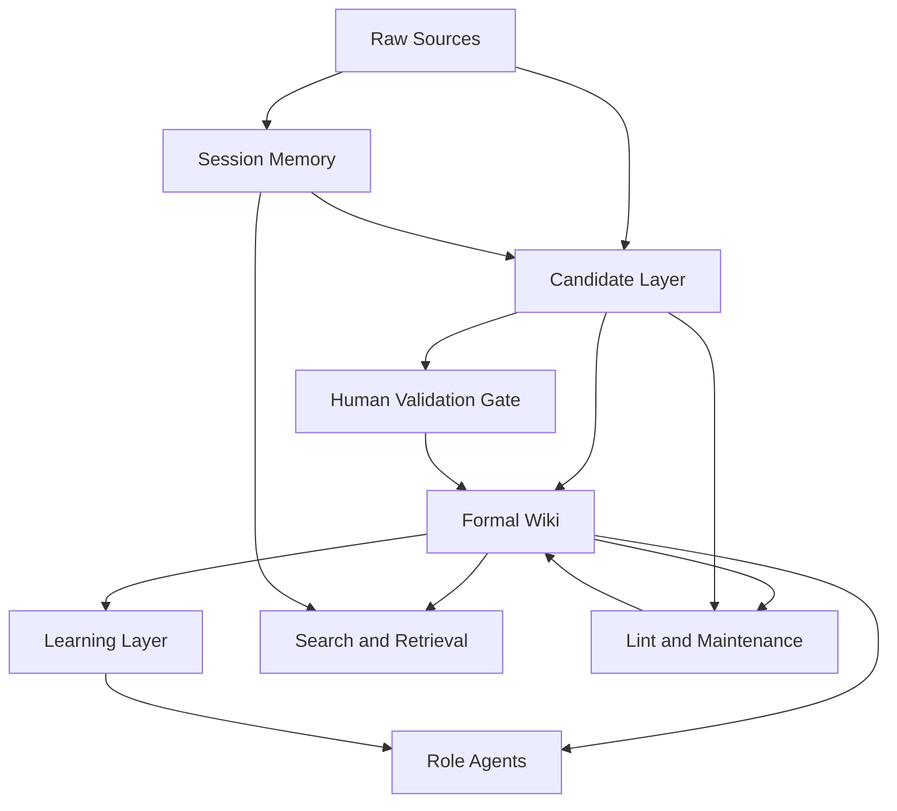

# Knowloop 시스템 아키텍처

## 1. 문서 목적

이 문서는 Karpathy의 LLM Wiki 아이디어와 관련 구현체 조사 결과를 바탕으로, Knowloop(`Edu Memory OS`)의 실전형 아키텍처를 정리한 문서다.

참고:
- 이 문서는 Knowloop의 목표 아키텍처를 설명한다.
- 현재 MVP에서 실제로 잠근 범위는 `docs/product/mvp-scope.md`, `docs/architecture/data-contracts.md`, `docs/architecture/promotion-policy.md`를 우선 기준으로 본다.

핵심 방향은 단순한 RAG 챗봇이 아니라, raw source와 대화에서 지속적으로 wiki를 작성·갱신하고 그 wiki를 주요 지식원으로 참조하는 `LLM-Wiki 기반 Memory OS`를 만드는 것이다.

- 학생의 질문과 학습 흔적이 휘발되지 않고 축적된다.
- 교강사는 학생이 어디서 막히는지 구조적으로 파악할 수 있다.
- 교육 운영자는 공지, 문의, 운영 지식이 흩어지지 않게 관리할 수 있다.
- AI가 답변만 생성하는 것이 아니라, 교육 현장의 맥락을 계속 정리하고 갱신한다.

---

## 2. 설계 원칙

조사한 구현체들에서 공통으로 건진 핵심 원칙은 다음과 같다.

1. `raw source`는 절대 버리지 않는다.
- 강의자료, 학생 질문, 과제 피드백, 공지, 상담 메모는 모두 원본으로 보존한다.
- 위키는 원본의 대체물이 아니라, 원본 위에 쌓이는 구조화 계층이다.

2. `candidate layer` 없이 바로 정식 위키로 올리지 않는다.
- 학생 질문이나 AI 답변은 미완성, 오개념, 임시 판단이 섞여 있다.
- 따라서 `후보 지식 -> 검토 -> 승격/병합/폐기` 단계가 필요하다.

3. 모든 상호작용은 두 개의 결과를 남긴다.
- 사용자에게 보여주는 답변 1개
- 시스템 내부에 축적되는 위키/학습 레이어 업데이트 1개

4. 학생용 기능은 자동 정리로 끝나면 안 된다.
- 자동 요약만 하면 “정리된 것처럼 보이는 착각”이 생긴다.
- 따라서 회상, 복습, 약점 진단, 퀴즈 같은 `학습 개입 레이어`가 반드시 필요하다.

5. 초반에는 파일 기반 위키로 시작하되, 검색과 감사 추적은 구조화한다.
- 초기 MVP는 Markdown + SQLite 조합으로 충분하다.
- 규모가 커지면 Binder 같은 structured query 방향으로 확장한다.

---

## 3. 제안하는 전체 구조



### 핵심 레이어

#### 3.1 Raw Sources

정의:
- 강의자료 PDF/PPT
- 강의 녹화 자막
- 학생 질문 로그
- 과제/시험 결과
- 과제 피드백
- 공지사항
- 상담 메모
- 운영 정책 문서

역할:
- 원본 보관
- 출처 추적
- 위키 내용 검증의 기준점

#### 3.2 Session Memory

정의:
- 학생과 AI 사이의 대화
- 교강사와 AI 사이의 수업 준비 대화
- 운영자와 AI 사이의 운영 질의응답

역할:
- 최근 대화 맥락 검색
- “예전에 무슨 질문을 했는지” 회수
- formal wiki로 승격하기 전의 중간 기억 저장소

구현 포인트:
- `sessions/` 디렉터리 + SQLite FTS5
- role, user_id, class_id, course_id, timestamp, tags 메타데이터 저장

참고:
- `bashiraziz/llm-wiki-template`
- `VihariKanukollu/browzy.ai`

#### 3.3 Candidate Layer

정의:
- 아직 정식 지식으로 확정되지 않은 메모
- 잠정 오개념
- 개입 가설
- 미해결 질문
- 반복 질문 후보

역할:
- 위키 오염 방지
- 학생의 미완성 이해를 안전하게 보관
- 교강사 검토 전 임시 상태 유지

상태 예시:
- `open`
- `promoted`
- `merged`
- `dropped`

참고:
- `Nimo1987/atomic-knowledge`

#### 3.4 Formal Wiki

정의:
- 검토를 거친 정식 지식층

구성 예시:
- 과목 개념 페이지
- 선수지식 페이지
- 오개념 지도
- 자주 묻는 질문
- 주차별 요약
- 반별 인사이트
- 운영 FAQ
- 정책/규정 해설

역할:
- 역할별 에이전트가 답변할 때 가장 먼저 참조하는 지식층
- 시간에 따라 계속 갱신되는 조직형 메모리

참고:
- `xoai/sage-wiki`
- `wastedcode/memex`

#### 3.5 Learning Layer

아래 구성은 목표 구조 관점의 확장 예시이며, 현재 MVP의 최소 구현 범위는 `docs/product/mvp-scope.md`와 `docs/architecture/data-contracts.md`를 따른다.

정의:
- 학생 개인 학습을 돕기 위한 후속 레이어

구성 예시:
- 약점 개념 목록
- gap tracker
- flashcards
- spaced repetition 큐
- 회상 질문
- 오늘 배운 것 요약

역할:
- 자동 요약을 실제 학습 성과로 연결
- “배웠다”를 “기억하고 설명할 수 있다”로 전환

참고:
- `arturseo-geo/llm-knowledge-base`
- `dkushnikov/mnemon`

#### 3.6 Search / Retrieval / Audit

정의:
- formal wiki 검색
- session memory 검색
- candidate 검색
- 변경 이력, 감사 로그, 최신성 점검

역할:
- query 성능 유지
- stale 정보 탐지
- 운영 안정성 확보

초기 MVP:
- SQLite FTS5 + BM25

확장 시:
- hybrid search
- ontology traversal
- transaction log 기반 감사 추적

참고:
- `xoai/sage-wiki`
- `mpazik/Binder`

---

## 4. 역할별 에이전트 설계

### 4.1 Student Agent

입력:
- 학생 질문
- 학생 개인 session memory
- 학생 개인 learning layer
- course formal wiki

출력:
- 답변
- candidate 업데이트
- 학습 개입 액션

예시 기능:
- “내가 자주 헷갈리는 개념 보여줘”
- “이번 시험 전에 내 약점만 정리해줘”
- “이전 질문과 연결해서 설명해줘”

### 4.2 Instructor Agent

입력:
- 강의자료
- 반 전체 질문 패턴
- candidate 집합
- 반 전체 formal wiki

출력:
- 다음 수업 보충 포인트
- 반복 오개념 리포트
- FAQ/오개념 페이지 갱신 제안

예시 기능:
- “이번 주 학생들이 어디서 막혔는지”
- “다음 수업 시작 전에 5분 보충할 내용”
- “반복되는 질문을 정리해 공지 초안 생성”

### 4.3 Operator Agent

입력:
- 공지
- 반복 문의
- 운영 정책
- 상담 메모

출력:
- 운영 FAQ
- 공지 충돌 감지
- 민원 분류
- 일정/규정 변경 영향 요약

### 4.4 Librarian / Validator Agent

입력:
- candidate items
- 검토 대기 knowledge draft
- lint 결과

출력:
- promote / merge / drop
- 출처 검증 상태
- stale 표시

핵심 원칙:
- 학생 질문에서 나온 내용이 바로 공용 위키로 가지 않음
- MVP에서는 사람 승인 후에만 승격

참고:
- `pnakamura companion gist`

---

## 5. 주요 워크플로

### 5.1 Ingest

흐름:
1. raw source 수집
2. source type 분류
3. 관련 session/context 탐색
4. candidate 생성 또는 기존 candidate 병합
5. formal wiki patch draft 생성
6. validator 또는 교강사 승인
7. index/log/metadata 갱신

예시:
- 새 강의자료 업로드
- 해당 강의자료와 연결된 개념 페이지, FAQ, 선수지식 페이지, 오개념 후보가 업데이트됨

### 5.2 Query

흐름:
1. user role 확인
2. session memory에서 최근 맥락 회수
3. formal wiki 검색
4. learning layer 또는 candidate 보조 참조
5. 답변 생성
6. 답변 내용을 write-back 후보로 저장

중요:
- 답변만 생성하고 끝내지 않는다.
- 좋은 답변은 `개인 학습 노트`, `FAQ 후보`, `오개념 후보`로 다시 남겨야 한다.

### 5.3 Write-back

유형:
- 학생 개인 학습 위키 업데이트
- 반 전체 FAQ 후보 생성
- 오개념 후보 생성
- 운영 FAQ 후보 생성

승격 규칙 예시:
- 동일 질문이 여러 학생에게 반복되면 candidate -> FAQ 검토
- 교강사가 보충설명으로 승인하면 candidate -> formal wiki promoted

### 5.4 Lint / Maintenance

점검 항목:
- 고아 페이지
- source 없는 주장
- 오래된 공지/규정
- 미승격 candidate 누적
- 반론/데이터 공백 미기재
- 반복 질문인데 formal wiki 반영이 안 된 경우

결과:
- health score
- review queue
- stale marker
- 추천 유지보수 액션

---

## 6. 권장 디렉터리 구조

아래 구조는 목표 디렉터리 예시다. 현재 MVP에서는 일부 파일만 우선 구현할 수 있다.

```text
/data
  /raw
    /courses
    /assignments
    /announcements
    /counseling
  /sessions
    /student
    /instructor
    /operator
  /candidate
    /misconceptions
    /faq
    /interventions
  /wiki
    /courses
    /concepts
    /misconceptions
    /faq
    /operations
    index.md
    log.md
  /learning
    /students
      /{student_id}
        profile.md
        gaps.md
        flashcards.md
        review_queue.md
  /meta
    manifest.json
    lint-status.json
    audit.db
    sessions.db
```

---

## 7. 기술 스택 제안

## 7.1 현재 MVP

- Frontend: Next.js 또는 React
- Backend: FastAPI 또는 Node.js
- LLM orchestration: Python 중심이 구현 빠름
- Storage:
  - Markdown files
  - SQLite
  - FTS5
- Optional:
  - Qdrant 또는 pgvector는 MVP에서는 생략 가능

이유:
- 설명 가능성 높음
- 데모 제작 빠름
- 로컬에서도 잘 동작
- repo 기반 관리 가능

## 7.2 이후 확장

- Structured metadata store 추가
- audit/event log 분리
- hybrid search 도입
- role-based access control 강화
- validator workflow UI 추가

---

## 8. 구현체별 차용 전략

### 가져올 것

- `atomic-knowledge`
  - candidate lifecycle
  - active / recent / index 구조

- `sage-wiki`
  - compile / query / lint 파이프라인
  - hybrid search 설계
  - UI와 graph 아이디어

- `memex`
  - 운영 안정성
  - wiki별 queue
  - audit log 사고방식

- `llm-knowledge-base`
  - learning layer
  - spaced repetition / gap tracking

- `llm-wiki-template`
  - session export + SQLite FTS5

- `mnemon`
  - reader-context 기반 개인화 추출

### 당장 안 가져올 것

- Binder 수준의 완전 구조화 DB 전환
- 복잡한 vector infra
- 모든 역할의 완전 자동 승인
- 대규모 멀티테넌시

---

## 9. MVP 우선순위

### 반드시 넣을 것

1. raw source 저장
2. session memory 검색
3. candidate buffer
4. formal wiki 생성
5. 학생 개인 learning layer
6. 교강사용 반복 질문/오개념 뷰
7. lint 결과 일부 표시

### 나중에 넣을 것

1. ontology graph 정교화
2. 운영자 대시보드 고도화
3. 자동 검증 체계
4. structured DB 전환
5. multi-agent orchestration

---

## 10. 리스크와 방어 전략

### 리스크 1. 잘못된 지식 누적

대응:
- candidate 레이어 도입
- raw source 링크 강제
- stale / unverified 태그 유지

### 리스크 2. 학생 이해 형성 약화

대응:
- 자동 요약만 하지 않음
- 회상 질문, 퀴즈, gap tracker 필수

### 리스크 3. query 품질 저하

대응:
- session memory와 formal wiki 분리
- SQLite FTS5 도입
- index/log/manifest 유지

### 리스크 4. 운영 복잡도 폭증

대응:
- MVP에서는 Markdown + SQLite 조합 유지
- validator workflow를 최소 UI로 시작

---

## 11. 한 줄 결론

가장 현실적인 구현 방향은 다음과 같다.

`Atomic Knowledge의 candidate 규율 + Sage Wiki의 파이프라인 + Memex의 운영 구조 + LLM Knowledge Base의 학습 레이어 + Session FTS 검색`

즉, 교육용 LLM Wiki는 `챗봇`이 아니라 `raw -> candidate -> formal wiki -> learning -> maintenance`로 이어지는 교육 메모리 운영체제로 설계하는 것이 맞다.
