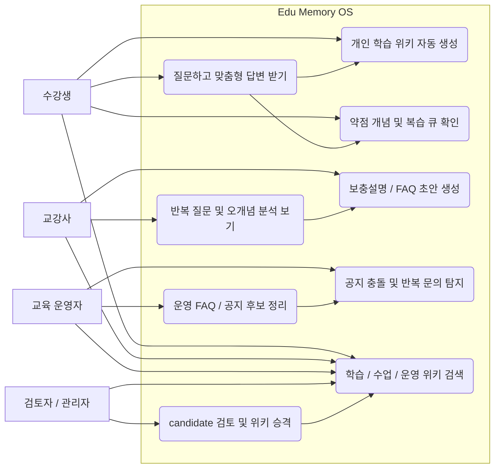
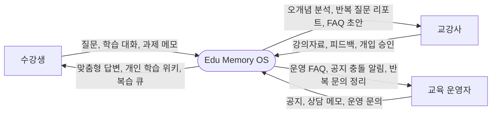
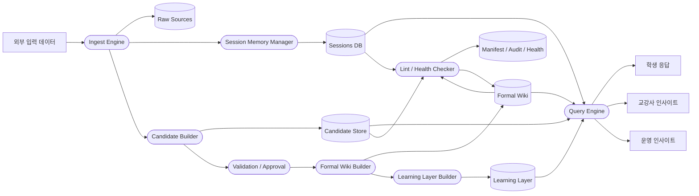
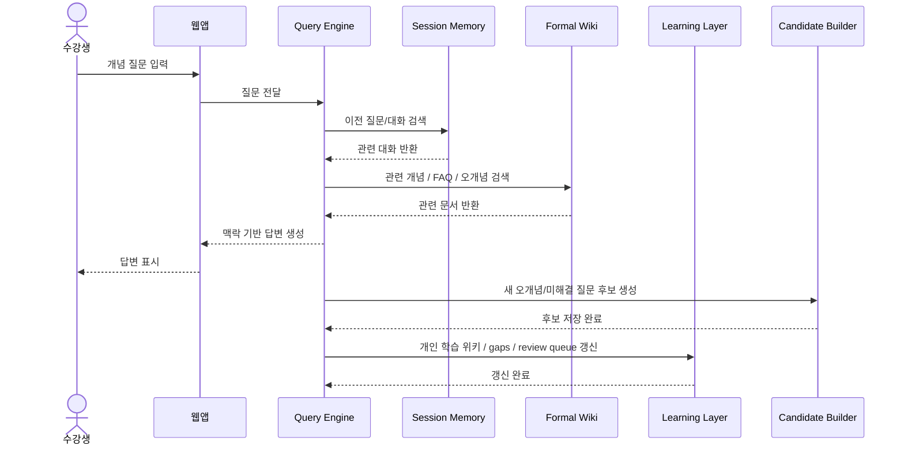
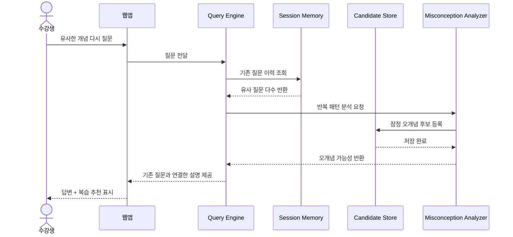
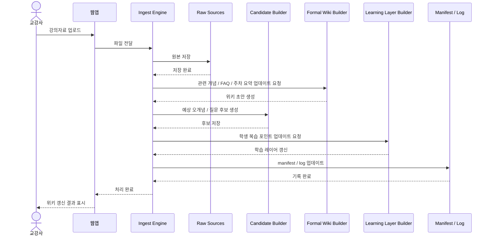
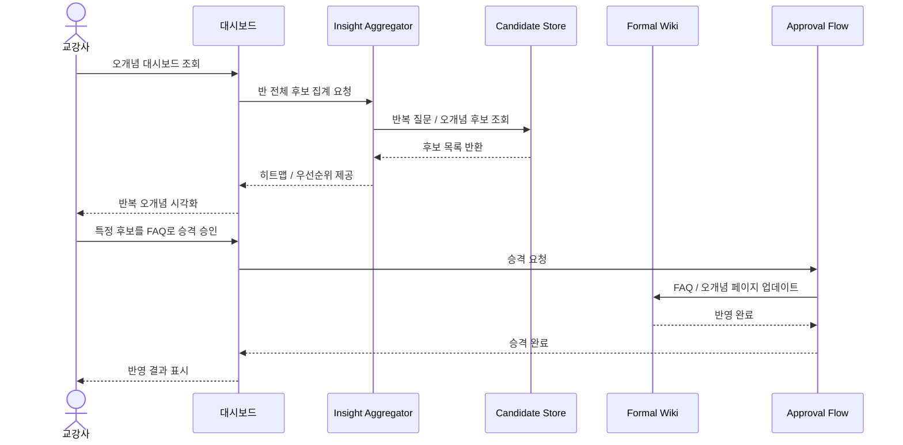
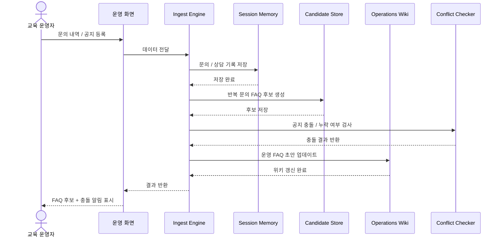
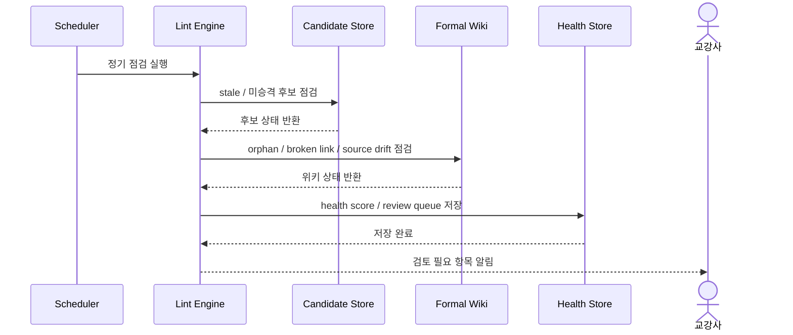

# Knowloop 시스템 다이어그램

## 1. 문서 목적

이 문서는 Knowloop(`Edu Memory OS`)의 핵심 구조를 다이어그램으로 정리한 문서이다.

참고:
- 이 문서는 전체 제품 구조와 목표 워크플로를 설명한다.
- 현재 MVP 시연 기준은 `docs/product/mvp-scope.md`, `docs/product/evaluation-plan.md`, `docs/product/demo-script.md`를 우선한다.

포함 범위는 다음과 같다.

- Use Case Diagram
- Data Flow Diagram
- Sequence Diagram

모든 다이어그램은 Mermaid 형식으로 작성했으며, 발표자료와 문서에 바로 옮겨 사용할 수 있다.

---

## 2. Use Case Diagram

### 2.1 전체 사용자-기능 관계

### 2.2 해설

- 수강생은 질문응답으로 끝나는 것이 아니라 `개인 학습 위키`, `약점 개념`, `복습 큐`까지 이어진다.
- 교강사는 단순히 질문을 받는 것이 아니라 `반복 질문`, `오개념`, `개입 포인트`를 확인한다.
- 교육 운영자는 `FAQ`, `공지`, `반복 문의`를 구조적으로 관리한다.
- 검토자 또는 관리자는 candidate를 정식 위키로 승격하는 품질 관리 역할을 맡는다.

---

## 3. Data Flow Diagram

## 3.1 Context Level Data Flow Diagram

### 의미

- 외부 사용자 3종이 시스템에 서로 다른 데이터를 제공한다.
- 시스템은 각 역할에 맞는 결과물을 되돌려준다.
- 핵심은 모든 입력이 단순 저장이 아니라 `지속형 메모리`로 축적된다는 점이다.

---

## 3.2 Internal Data Flow Diagram

### 의미

- `Raw Sources`는 원본 데이터 저장소다.
- `Session Memory`는 검색 가능한 대화 메모리다.
- `Candidate Store`는 아직 확정되지 않은 지식을 저장한다.
- `Formal Wiki`는 검토를 거친 공식 지식층이다.
- `Learning Layer`는 학생 개인 복습과 이해 강화를 위한 레이어다.
- `Lint / Health Checker`는 위키의 무결성과 최신성을 유지한다.

---

## 4. Sequence Diagram

## 4.1 기능 1: 수강생 질문응답 및 개인 학습 위키 갱신

### 핵심 포인트

- 질문은 답변으로 끝나지 않는다.
- 시스템은 동시에 `candidate`와 `learning layer`를 갱신한다.

---

## 4.2 기능 2: 반복 질문 누적으로 오개념 후보 생성

### 핵심 포인트

- 시스템은 단순히 “또 답변”하는 것이 아니라 `반복 패턴`을 감지한다.
- 반복 질문은 `candidate`를 통해 오개념 후보로 승격된다.

---

## 4.3 기능 3: 교강사 강의자료 업로드 후 위키 자동 갱신

### 핵심 포인트

- 강의자료는 단순 업로드 파일로 끝나지 않는다.
- 위키, 오개념 후보, 복습 포인트, 로그까지 함께 갱신된다.

---

## 4.4 기능 4: 교강사 오개념 대시보드 조회 및 candidate 승격

### 핵심 포인트

- 교강사는 분석 결과를 보기만 하는 것이 아니라 `승인`을 통해 공식 위키를 갱신한다.
- 이 승인이 지식 품질을 유지하는 핵심 장치다.

---

## 4.5 기능 5: 교육 운영자 문의 분석 및 운영 FAQ 생성

### 핵심 포인트

- 운영 영역도 동일한 패턴으로 동작한다.
- 문의는 세션 메모리로 저장되고, 반복되면 운영 FAQ 후보가 된다.

---

## 4.6 기능 6: Lint / Health Check 및 유지보수 루프

### 핵심 포인트

- Memory OS는 생성만 하는 시스템이 아니다.
- 유지보수와 건강 상태 점검이 있어야 지속 가능한 위키가 된다.

---

## 5. 발표 시 강조 포인트

다이어그램을 발표자료에 사용할 때는 다음 흐름으로 설명하는 것이 좋다.

1. `Use Case Diagram`
- 누가 이 서비스를 쓰는지
- 학생, 교강사, 운영자가 각각 어떤 실질적 문제를 해결하는지

2. `Context DFD`
- 왜 이 서비스가 단순 챗봇이 아닌지
- 입력과 출력이 역할별로 다르다는 점

3. `Internal DFD`
- raw -> session -> candidate -> wiki -> learning 구조가 핵심이라는 점

4. `Sequence Diagram`
- 질문 후 답변만 나오는 것이 아니라
- 위키, 후보 지식, 학습 레이어가 함께 갱신된다는 점

---

## 6. 한 줄 결론

본 서비스의 본질은 `질문에 답하는 AI`가 아니라, `질문과 수업과 운영의 상호작용을 축적 자산으로 바꾸는 교육 Memory OS`이며, 위 다이어그램들은 그 구조를 시각적으로 설명하기 위한 핵심 자료이다.
